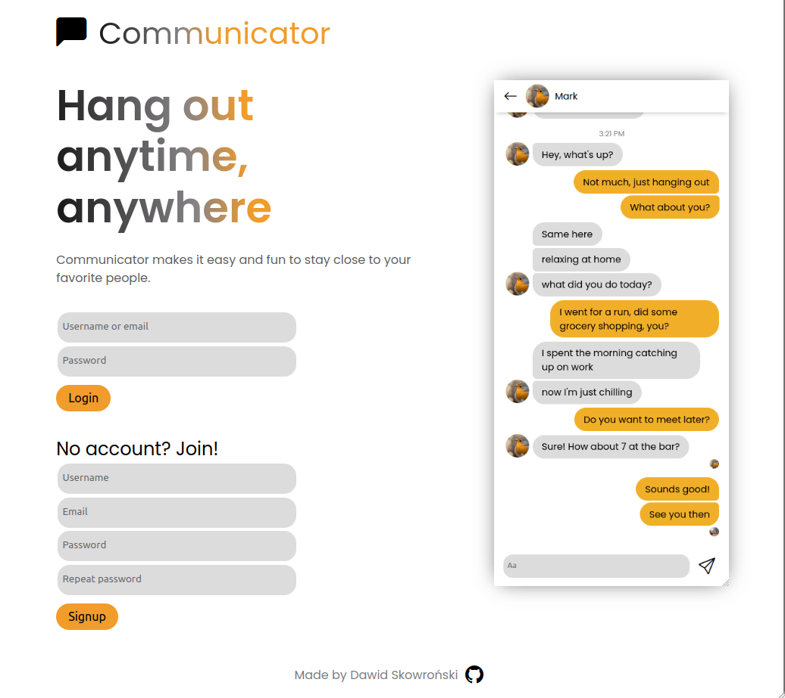
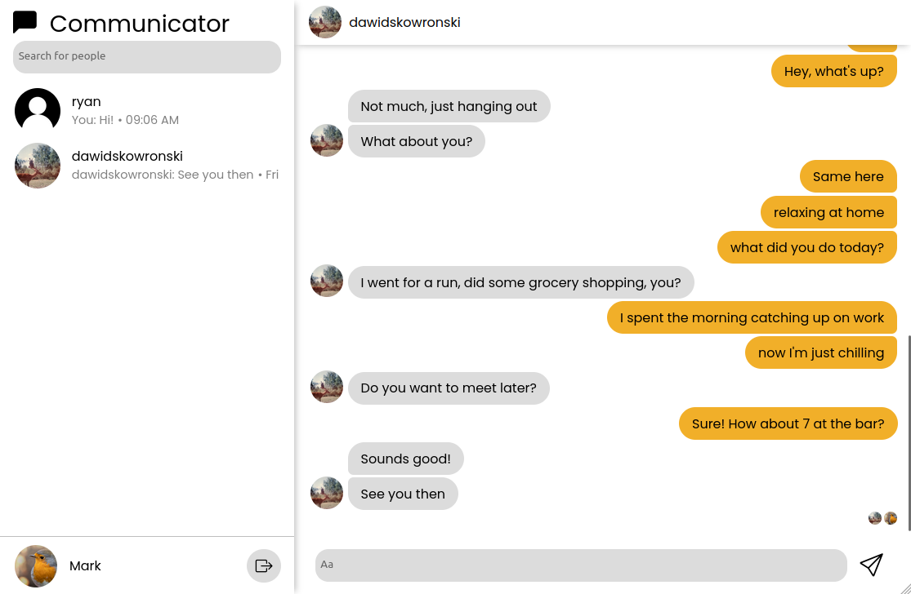
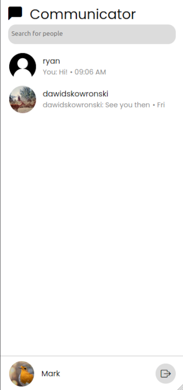

# Communicator

Fullstack web application. Facebook Messenger clone. Made in Django and React with PostreSQL database.

Live deployment: https://communicator.website/

## Features

- Real time chat
- Real time updates for friend lists and seen messages
- Looking for and adding new friends
- Saving messages and retriving them via API from database, inifite scroll
- JSON Web Token authentication for API and WebSocket connection
- Responsiveness, with URL routing dependent on screen size for better experience
- Dockerized with separate docker compose files for development and production
- nginx reverse proxy serving static and media files in production
## Screenshots



<p align="center">
  
  
</p>

## Technology stack

Backend:
- Django - backend
- DRF - API
- DRF Simple JWT - JSON Web Token authentication
- Django Channels - WebSocket

Frontend:
- React - frontend
- React Query - managing API and WebSocket data
- Axios - handling authentication header for API calls
- Jotai - passing state without prop drilling
- React Router DOM - handling paths

Other:
- PostgreSQL - database
- Docker - containerization
- nginx - reverse proxy

Full list of dependencies can be found in requirements.txt (backend) and package.json (frontend)
## Run development build

Clone the project

```bash
  git clone https://github.com/d-skowronski/Communicator.git
```

Go to the project directory

```bash
  cd Communicator
```

Start docker compose

```bash
  docker compose -f docker-compose-dev.yml up
```

Connect at http://localhost:3000

## Run production build

Clone and cd into the project as described in "Run development build" section

Create .env file

```bash
  nano .env
```

Fill .env file with required enviromental variables and customize them to your use case

```bash
BACKEND_ALLOWED_HOSTS=localhost
BACKEND_SECRET_KEY=changeme
DATABASE_PASSWORD=changeme
FRONTEND_API_URL=https://localhost/api/
FRONTEND_WEBSOCKET_URL=wss://localhost/ws/
```

(Recommended, first run only) Edit in docker-compose-prod.yml superuser credentials
```yaml
DJANGO_SUPERUSER_USERNAME=admin
DJANGO_SUPERUSER_EMAIL=admin@example.com
DJANGO_SUPERUSER_PASSWORD=changeme
```

Add your SSL certificate files in /proxy/certs folder in a format
- cert-key.pem
- cert.pem
*In case of running production build on a local machine self-signed certificate will suffice

Edit server_name fields in proxy/default.conf (by default - localhost)

Start docker compose

```bash
  docker compose -f docker-compose-prod.yml up
```

Connect at https://localhost

In case of production build there is an nginx server, providing the whole app on a single adress.

